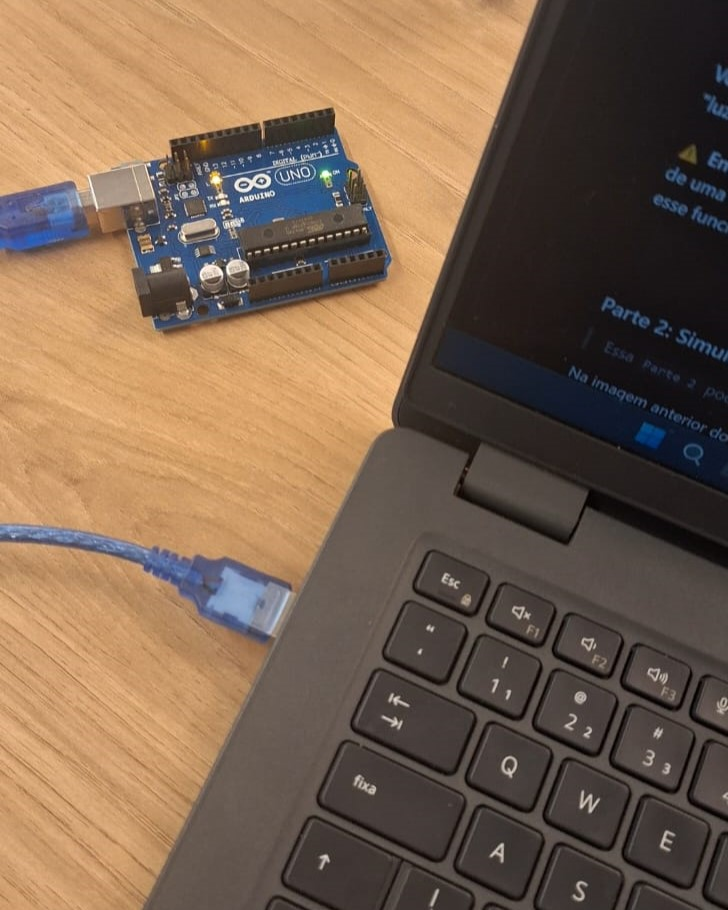

# Ponderada Programação - Semana 1 - Módulo 4

## Parte 1

Este repositório contém o código e a demonstração prática da realização do "blink" com o LED Interno do Arduino.

### Arquivos
- ***Screenshots da IDE***: [screenshoot_blink_ide.png](screenshot_ide_blink.png) - Imagem do código Arduino rodando no meu ambiente de desenvolvimento.

- **Imagem**: [foto_blink.jpg](foto_blink.jpg) - Imagem que mostra o Arduino conectado ao computador e com o LED aceso.

- **Vídeo**: [video_blink.mp4](video_blink.mp4) - Vídeo evidenciando o funcionamento do projeto.
- **Código**: [blink.ino](blink.ino) - Código responsável por acender e apagar o LED interno do Arduino em intervalos de tempo programados.

## Parte 2

Este repositório também contém a Parte 2 da atividade, utilizando o Arduino Uno para criar uma montagem do pisca-pisca.

### Simulação no TinkerCad

Você pode acessar a simulação deste projeto no TinkerCad através do link: [TinkerCad - Ponderada Parte 2](https://www.tinkercad.com/things/cWQ5PDSkEat-ponderada-1)

### Código
O código criado no TinkerCad está disponível no arquivo [code.ino](code.ino).

### Vídeo
O vídeo com a aplicação da simulação realizada no TinkerCad está no arquivo [video_pisca_pisca.mp4](video_pisca_pisca.mp4).

