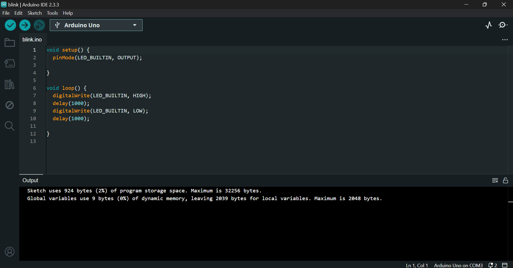

# README

## Ponderada Programação - Semana 1 - Módulo 4
Este repositório contém o código e a demonstração prática da realização do "blink" com o LED Interno do Arduino. Através da [Arduino IDE](https://www.arduino.cc/en/software), desenvolvi o código que permite o controle do LED e capturei *screenshot* desse código e um vídeo do hardware em funcionamento.

### Conteúdo do Repositório:
- ***Screenshots da IDE***: [screenshoot_blink_ide.png](screenshot_ide_blink.png) - Imagem do código Arduino rodando no meu ambiente de desenvolvimento.

<div align="center">

</div>

- **Imagem**: [foto_blink.jpg](foto_blink.jpg) - Imagem que mostra o Arduino conectado ao computador e com o LED aceso.

<div align="center">

</div>

- **Vídeo**: [video_blink.mp4](video_blink.mp4) - Vídeo evidenciando o funcionamento do projeto.
- **Código**: [blink.ino](blink.ino) - Código responsável por acender e apagar o LED interno do Arduino em intervalos de tempo programados.

```C++
void setup() {
  pinMode(LED_BUILTIN, OUTPUT);

}

void loop() {
  digitalWrite(LED_BUILTIN, HIGH);
  delay(1000);
  digitalWrite(LED_BUILTIN, LOW);
  delay(1000);

}
```
